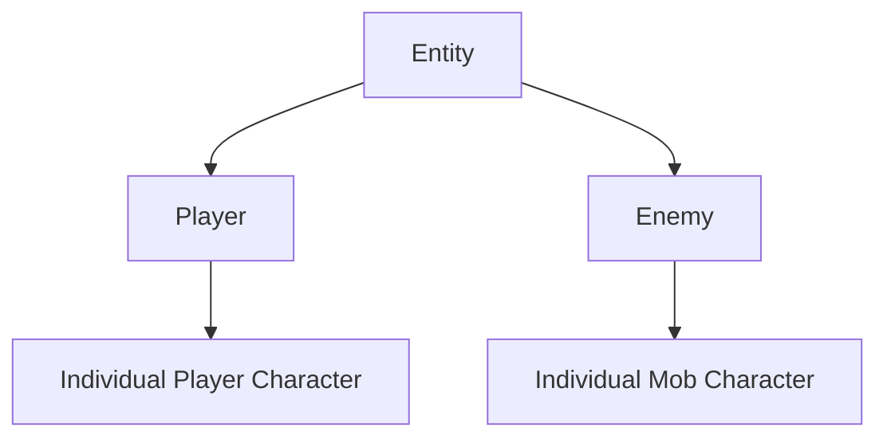

## Overview

The ECS is defined using only a few components which can be depicted as:

## Individual Classes
Each unique character is implemented as a dedicated class, positioned as the lowest node in the ECS hierarchy. At this level:

- The character establishes direct connections to its associated [[Ability Components]]
- It assumes full responsibility for controlling and configuring those abilities
- Character-specific logic and behavior overrides are applied, extending or replacing the base functionality inherited from higher-level archetypes (Player / Enemy)

## Category Classes

Every concrete individual character class inherits from exactly one **category class** (e.g. Player, Enemy, NPC, Boss, etc.).

Category classes serve as mid-level archetypes and define:

- A consistent set of base components
- Shared default behaviors
- Common systems interactions

that are meaningful **only** for entities within that particular category — not for all entities in the game.

This design ensures that:

- Core mechanics remain consistent within each category
- Unnecessary components/behaviors are not inherited by unrelated entity types
- Individual Classes can focus on only the very specific cases while inheriting sensible defaults

### Player

A category class that defines default behavior for all playable characters. Read more [here](Player).

### Enemy

A category class that defines default behavior for all mob characters. Read more [here](Enemy).

## Base Class

This class defines all behavior that differentiates entities from non-entities. It contains all essential functions like HP Management etc. Read more [here](Entity)